# Workshop diagrams

Six diagrams covering the parts of the day that are easier to see than to describe.

Each one exists twice. The **reference version** in this folder carries the full
detail and is meant to be read at your own pace — on GitHub, in the Codespace
preview, or projected when someone asks a follow-up question. The **slide
version** under `slide-versions/` is the same idea cut down to what stays
readable from the back of a room; those are the ones in the deck.

| File | Use it for |
|---|---|
| `<name>.mmd` | the source — edit this, then re-render |
| `<name>.svg` | scaling to any size without going fuzzy |
| `<name>.png` | embedding in docs; white background, rendered at 3x |

The sources carry their own theme settings, so they come out in the workshop's
colors wherever they are rendered.

## Re-rendering after an edit

```
npm install @mermaid-js/mermaid-cli
npx mmdc -i diagrams/agent-loop.mmd -o diagrams/agent-loop.svg
npx mmdc -i diagrams/agent-loop.mmd -o diagrams/agent-loop.png -b white -s 3
```

Slide versions use `-b transparent` instead, so the template's background shows
through behind them.

If you change a slide version, re-render it and re-insert the PNG on its slide;
the deck holds a copy of the image, not a link to this folder.

## Where the slide versions appear in the deck

| Diagram | Deck slide (v1.7) | Sits before |
|---|---|---|
| `agent-loop` | 19 — The Loop You're About to Write | Lab 1 |
| `mcp-stdio-sequence` | 45 — Discovery, Step by Step | Lab 6 |
| `two-surfaces` | 53 — What We're Actually Comparing | Lab 7 |
| `guardrail-decision-path` | 65 — One Tool Call, Every Branch | Lab 9 |
| `eval-harness` | 68 — The Harness, End to End | Lab 10 |

## Where the reference versions appear in labs.md

| Diagram | Lab | Step |
|---|---|---|
| `agent-loop` | Lab 1 | the closing "What just happened" |
| `mcp-stdio-sequence` | Lab 6 | step 3, before the first run |
| `guardrail-decision-path` | Lab 9 | step 2, before `guarded_call` is merged |

The other three are not referenced from the labs — they are here for the deck
and for answering questions.

---

## The agent loop

The loop every later lab reuses: reason, act, observe, repeat — plus the two exits the prose tends to skip, a reply that isn't valid JSON and a spent step budget. **Lab 1.**
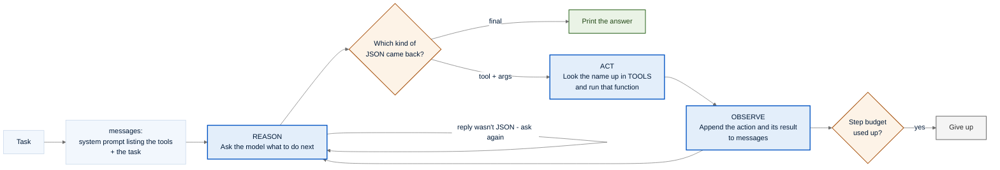

<details>
<summary>slide version — <code>slide-versions/agent-loop-slide.mmd</code></summary>

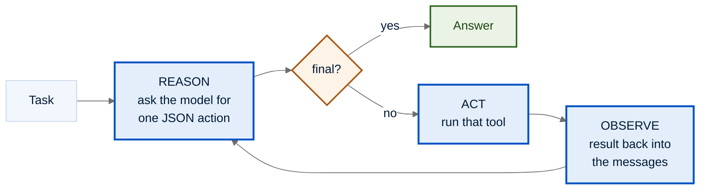

</details>

---

## One capability, two surfaces

The same four capabilities offered two ways — a CLI called as a subprocess, and an MCP server discovered over stdio. The point of **Labs 3 through 6**, and the setup for the Lab 7 comparison.
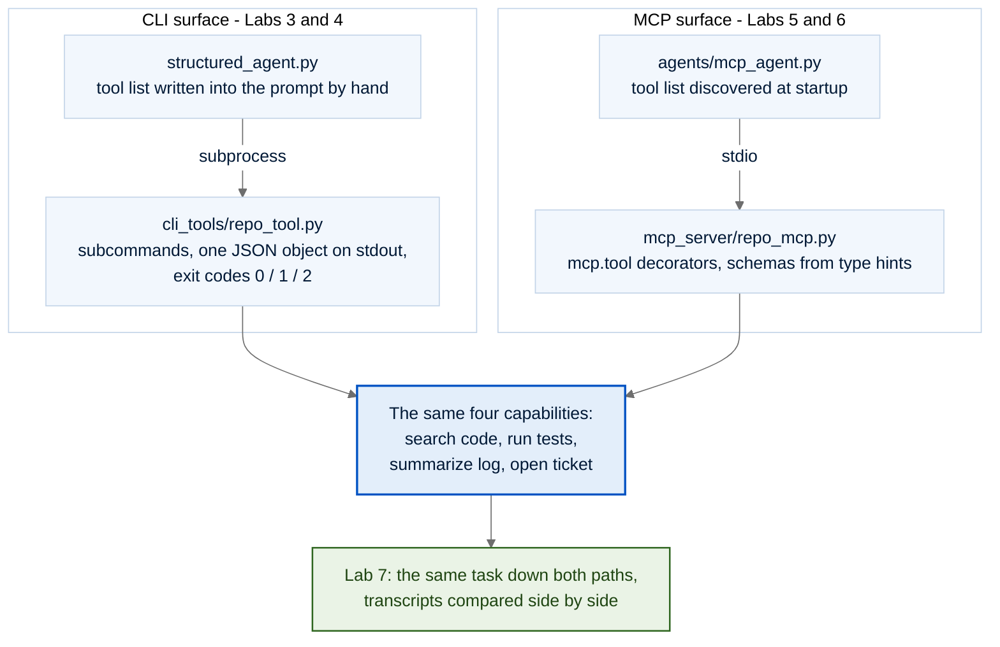

<details>
<summary>slide version — <code>slide-versions/two-surfaces-slide.mmd</code></summary>

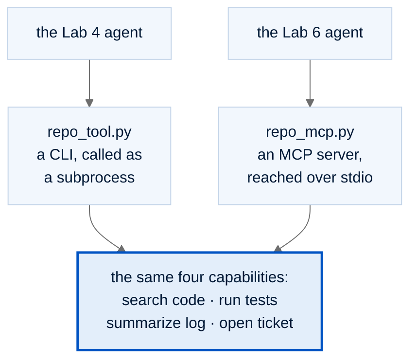

</details>

---

## What "over stdio" actually looks like

The agent launches the server as a subprocess, asks what tools exist, builds its prompt from the answer, and only then starts the loop. **Labs 5 and 6.**
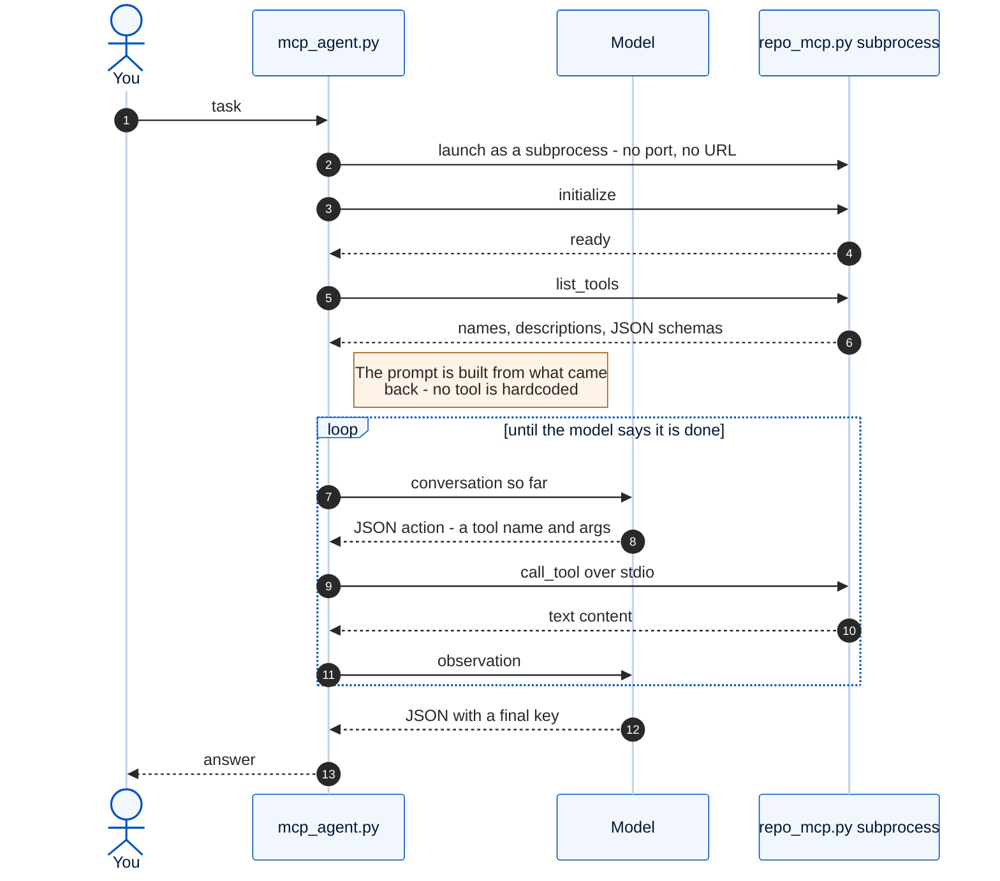

<details>
<summary>slide version — <code>slide-versions/mcp-stdio-sequence-slide.mmd</code></summary>

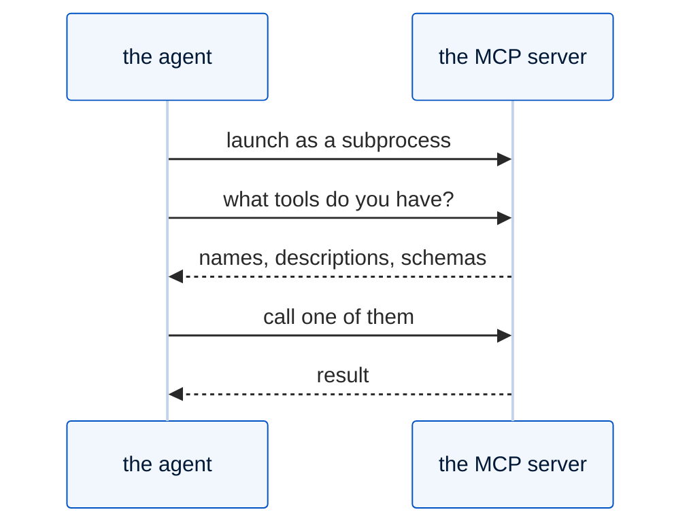

</details>

---

## The guardrail decision path

One proposed tool call, every branch it can take, and the audit line each branch leaves behind. Mirrors `guardrails/policy.py`. **Lab 9.**
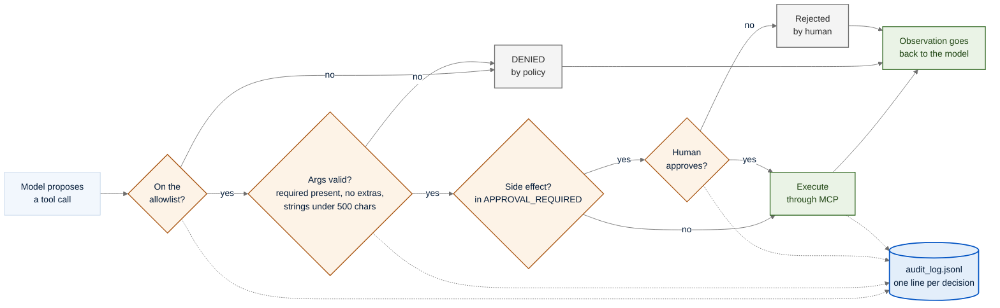

<details>
<summary>slide version — <code>slide-versions/guardrail-decision-path-slide.mmd</code></summary>

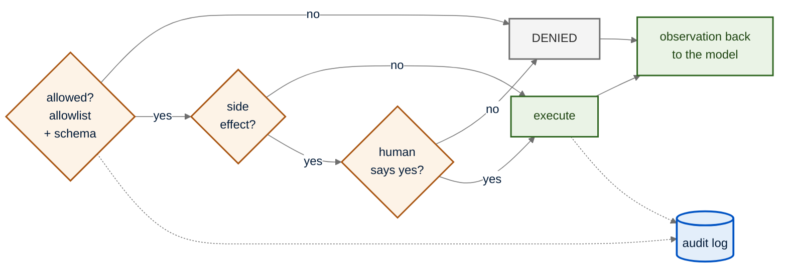

</details>

---

## The eval harness

Scenario in, plain-code checks out, and the arrow back to the top that is the whole argument for evals. **Lab 10.**
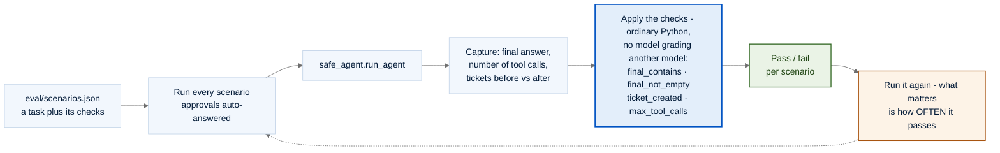

<details>
<summary>slide version — <code>slide-versions/eval-harness-slide.mmd</code></summary>

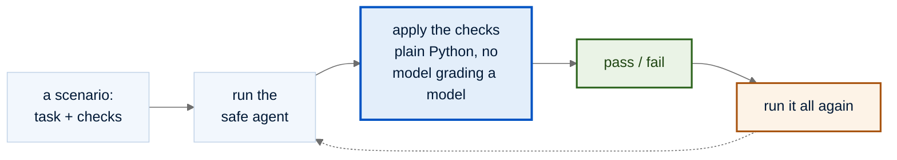

</details>

---

## The arc of the day

All ten labs and the file each one produces. Not in the deck — the agenda slide already covers this — but useful as a wall chart or when someone asks where a lab fits.
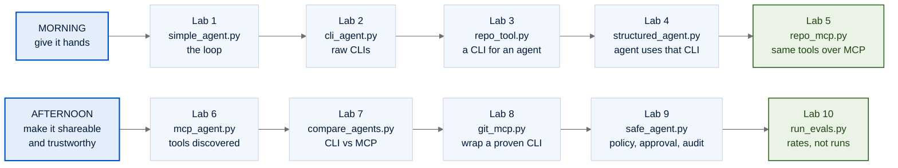
